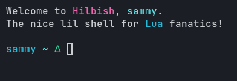
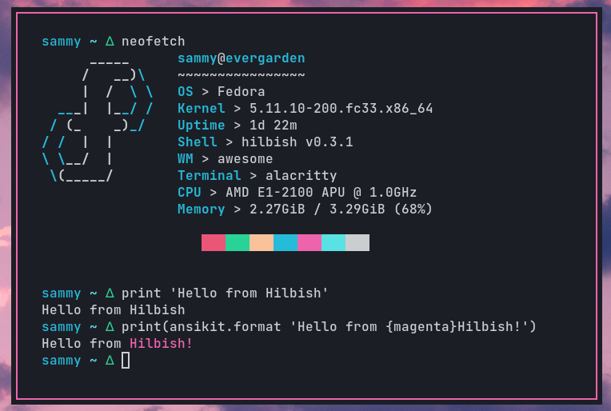

<div align="center">
	<h1>Hilbish</h1>
	<blockquote>
	🎀 a nice lil shell for lua people made with go and lua
	</blockquote><p align="center">
		<a href="https://github.com/Hilbis/Hilbish/issues?q=is%3Aissue+is%3Aopen+label%3A%22help+wanted%22"></a>
		<a href="LICENSE"></a>
	</p>
</div>

Hilbish is an interactive Unix-like shell written in Go, with the config
and other code written in Lua.  
It is sort of in a stable state currently, usable as a daily shell,
but there may still be breaking changes in Lua modules.

# Screenshots
<div align="center">
<br><br>
<br><br>

</div>

# Links
- **[Documentation](https://github.com/Hilbis/Hilbish/wiki)**
- **[Gallery](https://github.com/Hilbis/Hilbish/discussions/36)** - See
more screenshots of Hilbish in action

# Installation
**NOTE:** Hilbish is currently only officially supported and tested on Linux

### Prebuilt binaries
Binaries are provided for the latest commit.  

**Note that these use Hilbiline, not readline, and may be missing functionality
(moving the cursor, proper unicode support and backspace working properly)**  

Click on the checkmark (or x) near the commit hash, then details for your platform  
<br><br>

Then click on the artifacts drop down, and download artifact for your platform,
like what is highlighted in the screenshot.  
<br><br>

### Manual Build
#### Prerequisites
- [Go 1.16](https://go.dev)
- GNU Readline

On Fedora, readline can be installed with:  
```
sudo dnf install readline-devel
```  

On Debian/Ubuntu and distros based on them, it can be installed with:  
```
sudo apt install libreadline-dev
```

On OpenSUSE, it can be installed with:
```
sudo zypper install readline-devel
```

On Arch Linux, it can be installed with:
```
sudo pacman -S install readline
```

#### Build
First, clone Hilbish:
```sh
git clone --recursive https://github.com/Hilbis/Hilbish
cd Hilbish
# If you want the latest stable release, run this following command
git checkout $(git describe --tags `git rev-list --tags --max-count=1`)
```   

And get dependencies and build:  
```sh
go get -d all
make dev
# If you want to use latest stable release,
make build
# or want to use Hilbiline,
make hilbiline
```
#### Install
`sudo make install`

Alternatively, if you use Arch Linux, you can compile Hilbish with an **(unofficial)** AUR package:
```sh
yay -S hilbish
```
If you want the latest and greatest, you can install and compile from latest git commit: 
```sh
yay -S hilbish-git
```

### Uninstall
```sh
sudo make uninstall
```

# Contributing
Any kind of contributions to Hilbish are welcome!   
Make sure to read [CONTRIBUTING.md](CONTRIBUTING.md) before getting started.

### Special Thanks To
Everyone here who has contributed:

<a href="https://github.com/Hilbis/Hilbish/graphs/contributors">
  
</a>

*Made with [contributors-img](https://contrib.rocks).*

### Credits
- [This blog post](https://www.vidarholen.net/contents/blog/?p=878) which
is how Hilbish now inserts a newline even if output doesn't have one.

# License
Hilbish is licensed under the MIT license.  
[Read here](LICENSE) for more info.
